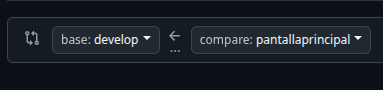

# Lab Phy

Lab Phy es una aplicación web que muestra componentes de laboratorio en 3D, acompañados de una descripción y un enlace a un video de YouTube relacionado.

---


## Tecnologías

- React  
- Vite  
- Node.js  

---

## Requisitos

- Node.js v14 o superior  
- npm (viene con Node.js)  

---

## Instalación

Si no tienes instalado Vite globalmente, puedes instalarlo con:

```bash
npm install -g create-vite
```


## Si ya tienes Vite o simplemente quieres usar el proyecto clonado, solo instala las dependencias con:

```bash
npm install
```
## Para iniciar el servidor de desarrollo:

```bash
npm run dev
```
# CUIDADO ⚠️
Al hacer un Pull Request, asegúrate de que la rama destino sea develop para mantener la integridad del flujo de trabajo.
# Ejemplo 



